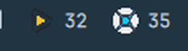
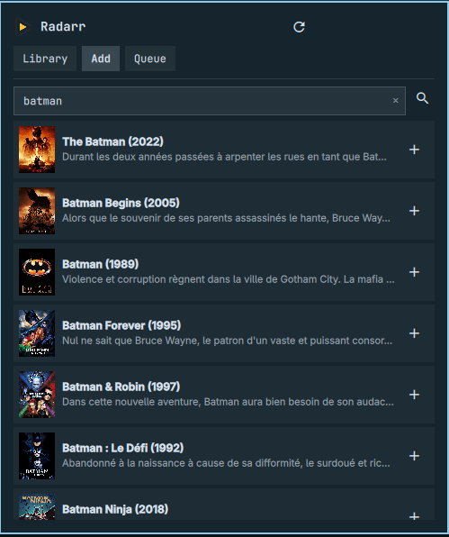
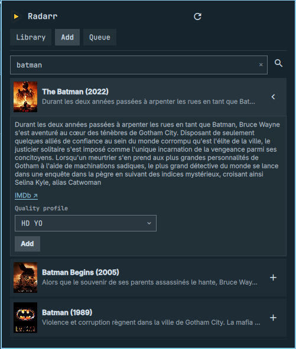

# omARR

Radarr and Sonarr in your Omarchy bar: library browsing, search + add with
poster art, and a combined download queue (aggregates every download client
Radarr/Sonarr know about — qBittorrent, NZBGet, etc. — via their own
`/api/v3/queue` endpoint, no separate client integration needed).

Add one bar-widget instance per app (Radarr and/or Sonarr). Each instance
polls its own lightweight status endpoint for the bar badge (missing count +
active downloads), and fetches the full library/queue only when you open the
panel.



<table>
<tr>
<td></td>
<td></td>
</tr>
</table>

## Features

- **Library tab**: browsable, filterable by title, paginated (15/page), with
  poster art. Filters for All / Downloaded / Missing. Radarr entries show
  audio language and subtitle availability (not available for Sonarr without
  one extra API call per series — shown as episode file count instead).
- **Add tab**: search by title, poster preview, pick a quality profile before
  confirming. For Sonarr: toggle season folders and select exactly which
  seasons to monitor.
- **Queue tab**: combined download queue with per-item progress and the
  source download client.
- Bar badge shows the missing-item count and, when non-zero, the active
  download count (`32 ↓3`).
- Manual refresh via middle-click on the bar widget, or the refresh button in
  the panel.

## Requirements

- A running Radarr and/or Sonarr instance reachable from the machine running
  Omarchy.
- An API key for each instance.

## Installation

```sh
omarchy plugin add https://github.com/boyoyooo/omarr.git --enable --yes
```

## Removal

```sh
omarchy plugin remove io.github.boyoyooo.omarr --yes
```

## Setup

### 1. Get the API key

In the Radarr or Sonarr web UI: **Settings → General**, scroll to the
**Security** section, and copy the **API Key** field (it's a long
alphanumeric string, already generated — nothing to create). Save it to a
file, outside version control:

```sh
mkdir -p ~/.config/omarchy/arr
echo -n "paste-the-api-key-here" > ~/.config/omarchy/arr/radarr-apikey
chmod 600 ~/.config/omarchy/arr/radarr-apikey
```

Repeat for Sonarr with its own key/file (e.g. `sonarr-apikey`).

### 2. Find your quality profile ID

The panel's "Add" tab needs a numeric `qualityProfileId`, but the Radarr/
Sonarr UI only shows profile *names* (**Settings → Profiles**), not their
IDs. List them with the key you just saved:

```sh
curl -s -H "X-Api-Key: $(cat ~/.config/omarchy/arr/radarr-apikey)" \
  http://localhost:7878/api/v3/qualityprofile | jq '.[] | {id, name}'
```

(swap the URL/key for Sonarr's `http://localhost:8989/api/v3/qualityprofile`).
Pick the `id` that matches the profile name you use, and use it as
`qualityProfileId` below.

### 3. Configure the widget instance

```json
{
  "id": "io.github.boyoyooo.omarr",
  "app": "radarr",
  "url": "http://localhost:7878",
  "apiKeyFile": "/home/you/.config/omarchy/arr/radarr-apikey",
  "label": "Radarr",
  "qualityProfileId": 1,
  "rootFolderPath": "/data/movies"
},
{
  "id": "io.github.boyoyooo.omarr",
  "app": "sonarr",
  "url": "http://localhost:8989",
  "apiKeyFile": "/home/you/.config/omarchy/arr/sonarr-apikey",
  "label": "Sonarr",
  "qualityProfileId": 1,
  "rootFolderPath": "/data/tv",
  "seasonFolder": true,
  "monitorMode": "all"
}
```

| Key                | Type   | Description                                                                                  |
| ------------------ | ------ | ---------------------------------------------------------------------------------------------- |
| `app`               | string | `"radarr"` or `"sonarr"`                                                                        |
| `url`               | string | Base URL, e.g. `http://host:port`                                                              |
| `apiKeyFile`        | string | Path to a file containing **only** the API key (no quotes, no trailing newline required)       |
| `interval`          | int    | Bar badge refresh interval in seconds (default 60; auto-retries every 5s while a fetch fails)  |
| `label`             | string | Display label next to the icon (defaults to "Radarr"/"Sonarr")                                 |
| `qualityProfileId`  | int    | Quality profile used when adding a new movie/series                                            |
| `rootFolderPath`    | string | Root folder used when adding                                                                    |
| `seasonFolder`      | bool   | Sonarr only: use season folders when adding                                                     |
| `monitorMode`       | string | Sonarr only: monitor mode when adding (`all`, `future`, `missing`, `firstSeason`, `none`, ...) |

## License

MIT — see [LICENSE](LICENSE).
